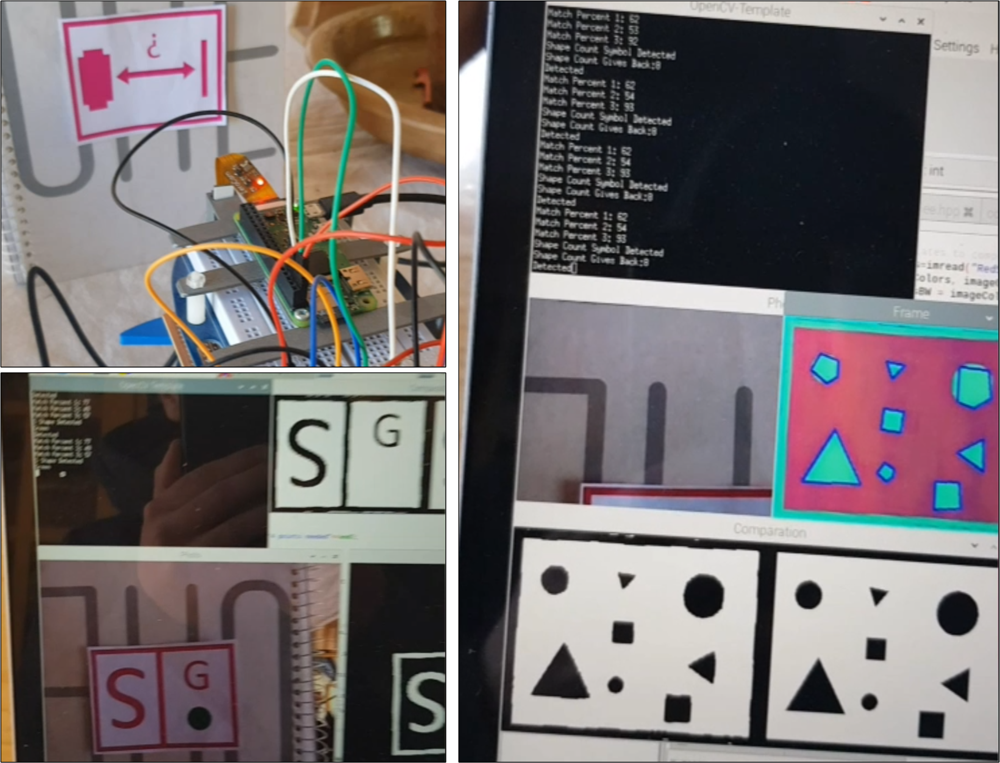

# ComputerVision-Bot
Repository which holds my project for computer vision, which aimed to have a small bot moving in different directions depending on the image detected.

Developed in C++ with the use of a Raspberry Pi and an Arduino. This project used the library "OpenCV" to achieve edge detection and color detection to recognize the different shapes necessary.

## Folders and Files
* ** ComputerVision: ** This folder holds the code for both the Raspberry Pi and the Arduino to achieve computer vision. The Arduino is used to control the robot, while the Raspberry Pi was used with its camera to detect the necessary image and communicate through I2C what type of movement had to be made.
* ** PID: ** This folder holds the code for the bot to follow a black line on the floor using a PID algorithm.

## Requirements
The OpenCV library.

